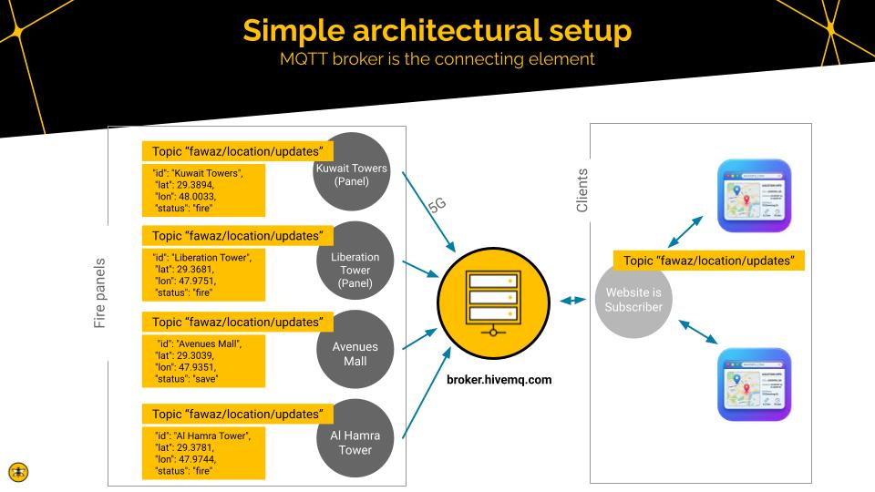

# firewarning

## Install:

```
git clone  https://github.com/floresboy/firewarning.git
cd firewarning
npm install
```

For MQTT CLOI tooling see [here](https://www.hivemq.com/blog/mqtt-cli/)

## Start:

```
nodemon server.js
open http://localhost:3000
mqtt sub -h broker.hivemq.com -t fawaz/location/updates -J
```

## Dataflow



## Send fire alarms

```
mqtt pub -h broker.hivemq.com -t fawaz/location/updates -m \
'{
"id": "Al Hamra Tower",
"lat": 29.3781,
"lon": 47.9744,
"status": "fire"
}'

mqtt pub -h broker.hivemq.com -t fawaz/location/updates -m \
'{
"id": "Liberation Tower",
"lat": 29.3681,
"lon": 47.9751,
"status": "fire"
}'

mqtt pub -h broker.hivemq.com -t fawaz/location/updates -m \
'{
"id": "Avenues Mall",
"lat": 29.3039,
"lon": 47.9351,
"status": "fire"
}'
```

## Cancel fire alarms

```
mqtt pub -h broker.hivemq.com -t fawaz/location/updates -m \
'{
"id": "Avenues Mall",
"lat": 29.3039,
"lon": 47.9351,
"status": "safe"
}'
```

