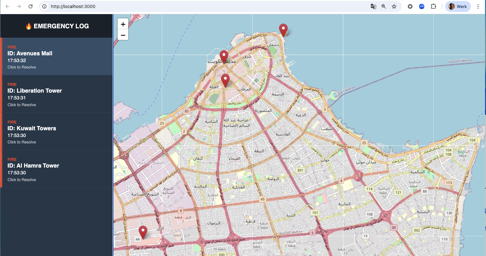

# Firewarning

This is a lightweight technology demonstrator consisting of a JS web server that hosts a map-based webpage displaying fire alarms received through an MQTT subscription. Alarms can be triggered by publishing MQTT messages to the public broker broker.hivemq.com, which is used for message transport.

You can use docker or install it on your local machine. "Start" fires by sending the appropriate MQTT messages.

## Docker

```
docker run --name firewarning-container -p 3000:3000 kamielstraatman/firewarning-app:latest
```

## Install:

```
git clone  https://github.com/floresboy/firewarning.git
cd firewarning
npm install
```

For MQTT CLI tooling see [here](https://www.hivemq.com/blog/mqtt-cli/)

## Start:

```
nodemon server.js
open http://localhost:3000
mqtt sub -h broker.hivemq.com -t fawaz/location/updates -J
```

## Dataflow


## Send fire alarms

For MQTT CLI tooling see [here](https://www.hivemq.com/blog/mqtt-cli/)

```
mqtt pub -h broker.hivemq.com -t fawaz/location/updates -m \
'{
"id": "Al Hamra Tower",
"lat": 29.3781,
"lon": 47.9744,
"status": "fire"
}'

mqtt pub -h broker.hivemq.com -t fawaz/location/updates -m \
'{
 "id": "Kuwait Towers",
  "lat": 29.3894,
  "lon": 48.0033,
  "status": "fire"
}'

mqtt pub -h broker.hivemq.com -t fawaz/location/updates -m \
'{
"id": "Liberation Tower",
"lat": 29.3681,
"lon": 47.9751,
"status": "fire"
}'

mqtt pub -h broker.hivemq.com -t fawaz/location/updates -m \
'{
"id": "Avenues Mall",
"lat": 29.3039,
"lon": 47.9351,
"status": "fire"
}'
```

## Cancel fire alarms

```
mqtt pub -h broker.hivemq.com -t fawaz/location/updates -m \
'{
"id": "Avenues Mall",
"lat": 29.3039,
"lon": 47.9351,
"status": "safe"
}'
```

## Webview

sds




ss

